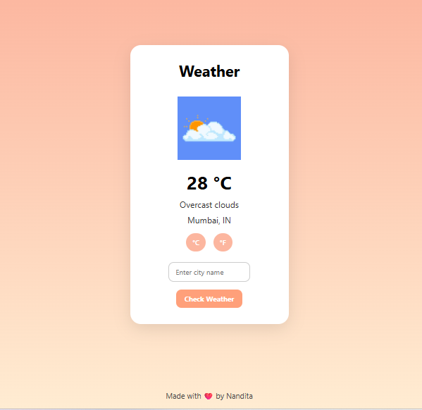

# 🌤️ Pixel Weather Widget

A cute, animated pixel-style weather widget that shows real-time weather updates using the OpenWeatherMap API. Switch between °C and °F and check weather for any city with a click.

## ✨ Features

- 🌎 Search weather for any city
- 🌡️ Toggle between Celsius and Fahrenheit
- ⛅ Dynamic icons based on weather condition
- 📱 Responsive design
- 💖 Pixel-art inspired UI

## 🔧 Technologies Used

- HTML5
- CSS3
- JavaScript (Vanilla)
- OpenWeatherMap API

## 📸 Demo

📍 Deployed at:  
**https://nanditasarwate.github.io/weather-widget/**

## ✍️ Made with ❤️ by Nandita